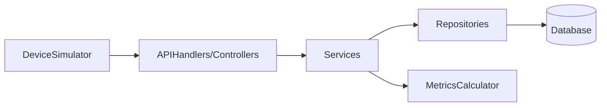

# Fleet Monitor

Small Go service for the SafelyYou fleet monitoring assignment.

It loads known devices from `data.csv`, accepts heartbeat and upload telemetry, and exposes per-device uptime and average upload time over HTTP.

## Requirements

- Go 1.24+
- `data.csv` in the project root
- `openapi.json` for the API contract

## Run locally

Start the server:

```bash
go run .
```

By default the service listens on `http://127.0.0.1:6733`.

Optional flags:

```bash
go run . -port 8080 -devices data.csv
```

You can also set the port with an environment variable:

```bash
PORT=8080 go run .
```

## API

The API contract is defined in `openapi.json`.

Implemented routes:

- `POST /api/v1/devices/{device_id}/heartbeat`
- `POST /api/v1/devices/{device_id}/stats`
- `GET /api/v1/devices/{device_id}/stats`

## Project structure

- `main.go`: app bootstrap, flags, and route registration
- `handlers.go`: HTTP handlers and request/response helpers
- `store.go`: in-memory device store and telemetry writes
- `metrics.go`: uptime and average upload time calculations
- `devices.go`: CSV loading for known device IDs
- `models.go`: request and response models

## Verification

The included simulator was run against the service on port `6733`.

The output in `results.txt` shows that expected and actual values matched for all devices for both:

- `uptime`
- `avg_upload_time`

## Write-Up

### Time spent / Hardest part

This solution was kept intentionally small and focused on correctness first. The hardest part was making sure the uptime calculation matched the simulator's interpretation exactly while keeping the implementation easy to read.

### Extensibility

If I needed to support more metrics, I would keep the same overall shape and add metric-specific data and calculations in small, focused units instead of introducing broad abstractions early.

Examples:

- add new telemetry fields to the per-device data model
- keep ingestion logic in the store simple and append-only
- add new calculation functions alongside `metrics.go`
- add targeted tests for each new metric independently

If the number of metrics grew significantly, I would likely move from parallel slices to small domain structs per metric sample.

### Runtime complexity

- Device lookup is `O(1)` on average because devices are stored in a map keyed by `device_id`.
- Recording a heartbeat or upload stat is `O(1)` amortized.
- `GET /stats` is `O(h + u)` for a device, where `h` is the number of heartbeats and `u` is the number of upload samples for that device, because the service scans those slices to compute uptime and average upload time.

## Notes

- The service uses only the Go standard library.
- Data is stored in memory for the scope of the assignment.
- The implementation favors clarity and a small surface area over premature abstraction.

## Additional writeup

### AI usage

I used AI tools selectively to help review structure, explain certain tradeoffs/practices, and improve the readme.

### Security, testing, and deployment

For the assignment, I kept the implementation intentionally small and in-memory. If I were taking this toward production, I would focus on a few practical improvements first:

- add unit tests for metric calculation and handler behavior
- limit request body size and validate input more strictly
- add graceful shutdown and structured logging
- containerize the service and run it behind a load balancer
- move device data and telemetry storage into a persistent database if durability were required

### Alpha prototype structure

For an alpha prototype, I would first add persistent storage so devices and telemetry survive restarts. If the application grew beyond a single in-memory service, I would then separate HTTP handlers from domain services and repository/database access.



- `APIHandlers/Controllers` would handle HTTP requests and responses
- `Services` would contain the application logic
- `Repositories` would read and write persistent data
- `MetricsCalculator` would compute uptime and average upload time

